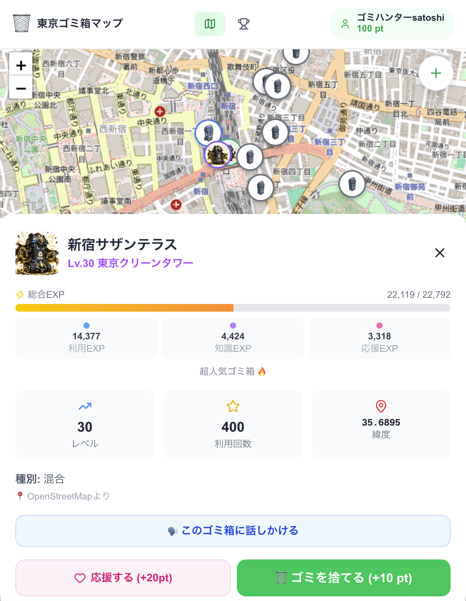

# 🗑️ AIゴミ箱育成プロジェクト

> 街中のゴミ箱をAIキャラクター化し、市民参加によって育成する位置情報サービス



## 概要

街中のゴミ箱は設置・維持にコストがかかる一方、不法投棄・家庭ゴミの持ち込み・清掃負荷といった問題もあり、設置側に十分なメリットが見えにくい現状があります。

一方で利用者は「ゴミ箱の場所を知りたい」「地域情報を手軽に得たい」というニーズを持っています。

本サービスはゴミ箱を**地域のAI情報拠点**として再定義し、市民参加によってその価値を高めます。

利用者がゴミ箱を利用・写真投稿・応援するたびにゴミ箱が成長し、レベルが上がったゴミ箱は周辺の文化財・公共施設を案内する**AIガイド**として機能します。その過程で蓄積されるデータは、管理者が利用状況・地域評価を把握するためのインフラデータ基盤にもなります。

### コンセプト

| 利用者から見ると | 管理者から見ると |
|---|---|
| ゴミ箱キャラクターを育てるゲーム | 利用状況・地域評価を可視化するダッシュボード |
| 地域のAI観光ガイド | ゴミ箱の設置・回収最適化のためのデータ基盤 |

### 解決する課題

**利用者**
- ゴミ箱の場所が分かりにくい
- 地域情報が分散している

**管理者**
- ゴミ箱の維持コストに見合うメリットが見えない
- 利用状況・地域からの評価が把握できない

### 活用するオープンデータ

| データ | 用途 |
|---|---|
| OpenStreetMap (`amenity=waste_basket`) | ゴミ箱の位置情報 |
| 文化財オープンデータ | 歴史解説・観光案内 |
| 公共施設オープンデータ | 図書館・公園・区民センターなどの案内 |

### ゴミ箱の育成システム

| アクション | EXP |
|---|---|
| ゴミ箱利用（GPS＋画像認識） | +10 EXP |
| 写真投稿 | +20 EXP |
| 応援ポイント付与 | +100 EXP |
| 新規ゴミ箱登録 | +200 EXP |

| レベル | 機能 |
|---|---|
| Lv.1 | 通常のゴミ箱 |
| Lv.10 | 周辺施設案内 |
| Lv.20 | 文化財解説 |
| Lv.30 | 地域イベント紹介 |
| Lv.50 | AIガイド化（利用者と会話可能） |

## セットアップ

```bash
npm install

# 環境変数を設定（DATABASE_URL は絶対パス推奨）
cp .env.local.example .env.local

# DBマイグレーション
DATABASE_URL="file:///絶対パス/prisma/prisma/dev.db" npx prisma migrate deploy

# シードデータ投入（デモ用ゴミ箱23件）
npm run db:seed

# OSMデータ取込（東京のゴミ箱 約458件）
npm run osm:import

# 公共施設・文化財データ取込（約378件）
npm run spots:import

npm run dev
```

http://localhost:3000 でアクセス

> **注意**: `DATABASE_URL` は相対パスだと実行環境によってズレるため、**絶対パス**で設定してください。

## 環境変数

`.env.local` に以下を設定：

| 変数 | 説明 | 必須 |
|------|------|------|
| `DATABASE_URL` | SQLite絶対パス（例: `file:///home/user/project/prisma/prisma/dev.db`） | ✅ |
| `WATSONX_API_KEY` | IBM Cloud API Key | 任意 |
| `WATSONX_PROJECT_ID` | watsonx.ai プロジェクトID | 任意 |
| `WATSONX_URL` | watsonx.ai エンドポイント | 任意 |

> `WATSONX_API_KEY` が未設定の場合はモック（AI判定は常に承認）で動作します

## 機能

- 🗺️ **OpenStreetMapベースのゴミ箱マップ** — 東京のゴミ箱をレベル別アイコンで表示
- 🗑️ **ゴミ箱を利用** — ボタン1タップで即ポイント獲得（写真はオプション）
- 📸 **写真投稿** — watsonx.ai（Llama 4 Maverick Vision）でゴミ箱を自動検出、追加ボーナス
- 🆕 **新規ゴミ箱登録** — 地図タップで未登録ゴミ箱を発見・登録（+100pt）
- ⭐ **3種EXP育成システム** — 利用・知識・応援の3軸でゴミ箱が成長
- ❤️ **応援ボタン** — ゴミ箱を応援してsupportEXP加算（24時間クールダウン）
- 🗣️ **ゴミ箱チャット** — ゴミ箱キャラクターと会話、周辺スポット案内
- 🏆 **ランキング** — ゴミ箱ハンターTop20

## ポイント体系

| アクション | ポイント |
|-----------|---------|
| 🗑️ ゴミ箱を利用（写真なし） | +10 pt |
| 📸 ゴミ箱を利用（写真あり・AI通過） | +30 pt |
| 🆕 新規ゴミ箱発見 | +100 pt |
| ❤️ ゴミ箱を応援 | +20 pt |

## ゴミ箱レベル・個性

| レベル | 名称 |
|-------|------|
| Lv.1〜4 | 小さなゴミ箱 |
| Lv.5〜9 | 中型ゴミ箱 |
| Lv.10〜19 | 大型ゴミ箱 |
| Lv.20〜29 | エコステーション |
| Lv.30〜49 | 東京クリーンタワー |
| Lv.50 | 東京クリーンタワー（MAX） |

3種EXPの比率によって個性ラベルが付きます（超人気🔥 / AI観光ガイド📚 / 地域シンボル❤️ / バランス⭐）

## 技術スタック

- **Frontend**: Next.js 16 (App Router) + TypeScript + Tailwind CSS v4
- **Map**: Leaflet + OpenStreetMap
- **Backend**: Next.js API Routes
- **AI**: watsonx.ai (Llama 4 Maverick Vision) — 画像判定・チャット・周辺案内
- **DB**: Prisma + SQLite
- **データソース**: OpenStreetMap (Overpass API) / 東京都公共施設・文化財CSV

## データリセット手順

### シードデータだけリセット（OSM・施設データは残す）

```bash
npm run db:seed:clear   # シードの23件を削除
npm run db:seed         # 再投入
```

### DB完全リセット（全データを消して再構築）

```bash
# 1. DBファイルを削除
rm prisma/prisma/dev.db

# 2. マイグレーション再実行（DB再作成）
DATABASE_URL="file:///絶対パス/prisma/prisma/dev.db" npx prisma migrate deploy

# 3. データ再投入
npm run db:seed         # デモ用シード（23件）
npm run osm:import      # OSMゴミ箱（約458件）
npm run spots:import    # 公共施設・文化財（約378件）
```

### 投稿写真だけ削除

```bash
# public/uploads/ 以下の画像ファイルを削除（.gitkeep は残る）
find public/uploads -type f ! -name '.gitkeep' -delete
```

## スクリプト一覧

| コマンド | 内容 |
|---------|------|
| `npm run dev` | 開発サーバー起動 |
| `npm run build` | プロダクションビルド |
| `npm run db:seed` | デモ用シードデータ投入（23件） |
| `npm run db:seed:clear` | シードデータ削除 |
| `npm run osm:import` | OSMからゴミ箱データ取込 |
| `npm run spots:import` | 公共施設・文化財データ取込 |
